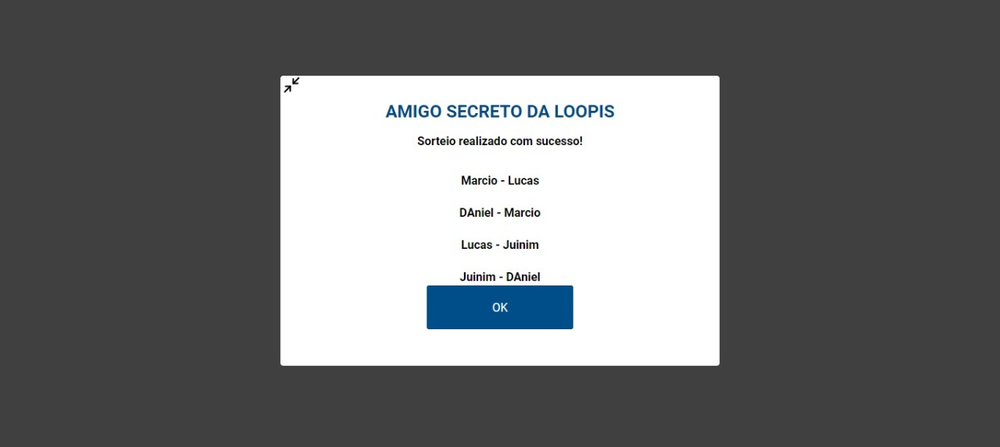

# Desafio da Loopis


<p align="center">
  
<br />
Aplicação de sorteio de **Amigo Secreto Loopis** desenolvida com **Node.js + Express** no *back-end*, com **Potsgres** como banco de dados e **React.js** no *front-end*. Tudo isso em typescript.</p>

## Rodando na sua máquina

**1:** Clone o repositório.

```
git clone https://github.com/farciomernandes/Desafio-Loopis.git
```

**2:** Acesse o diretório do projeto.

```
cd Desafio-Loopis
```

**3.1:** Instale as depedências do frontend.
```1- cd frontend 
   2- yarn
```
**3.2:** Instale as depedências do frontend.
```1- cd backend 
   2- yarn
```


**4:** Assegure-se que o docker está instalado na sua máquina e crie um novo container.
```
  1- Caso não tenha instaldo realize o dowload através do link: https://docs.docker.com/docker-for-windows/install/
  
  2- Após instalado inice o docker e digite a seguinte linha de comando 
  no seu terminal/cmd: docker run --name amigooculto -e POSTGRES_PASSWORD=docker -p 5432:5432 -d postgres
    2.1 Após rodar esse comando ele deve criar o container com a imagem mais rescente do postgres. 
    Para se certificar que tudo foi criado corretamente digite o comando: docker ps -a , e procure pelo nome amigooculto. Caso tenha encontrado digite docker start NOME_DO_CONTAINER.
```
  


**5:** Crie  uma database com o nome " amigo_oculto " na porta 5432 com a senha " docker ".
```
  1- Caso queira fazer exatamente como eu fiz realize o dowload do DBeaver: https://dbeaver.io/download/ .
  2- Após realizar o dowload abra o DBeaver e clique no conector abaixo da opção "file" e selecione o
  postgres. Altere a porta para 5432, e escolha a senha docker. Após clique em aceitar os dowloads e aguarde terminar.
  3- Após finalizar clique com o botão direito do mouse no icóne do Postgres que vai aparecer e selecione
  a opção Create > Database.
  4- Nomeie a database como " amigo_oculto " e em " ok ".
```

**6:** Crie as tabelas no banco de dados e inicie o backend.
```
  1- Acesse o diretório do backend e digite o comando: " yarn typeorm migration:run ".
  2- Caso tenha dado algum problema espere alguns minutos e rode o comando novamente,
  após isso digite " yarn dev:server " e seu backend já estará funcionando.
```

**7:** Inicie seu frontend.
```
  1- Navege até o diretório do frontend e digite " yarn start ". Aguarde e seu projeto irá iniciar na rota 
  " http://localhost:3000 ".
```

  


**Obrigado :D** 
